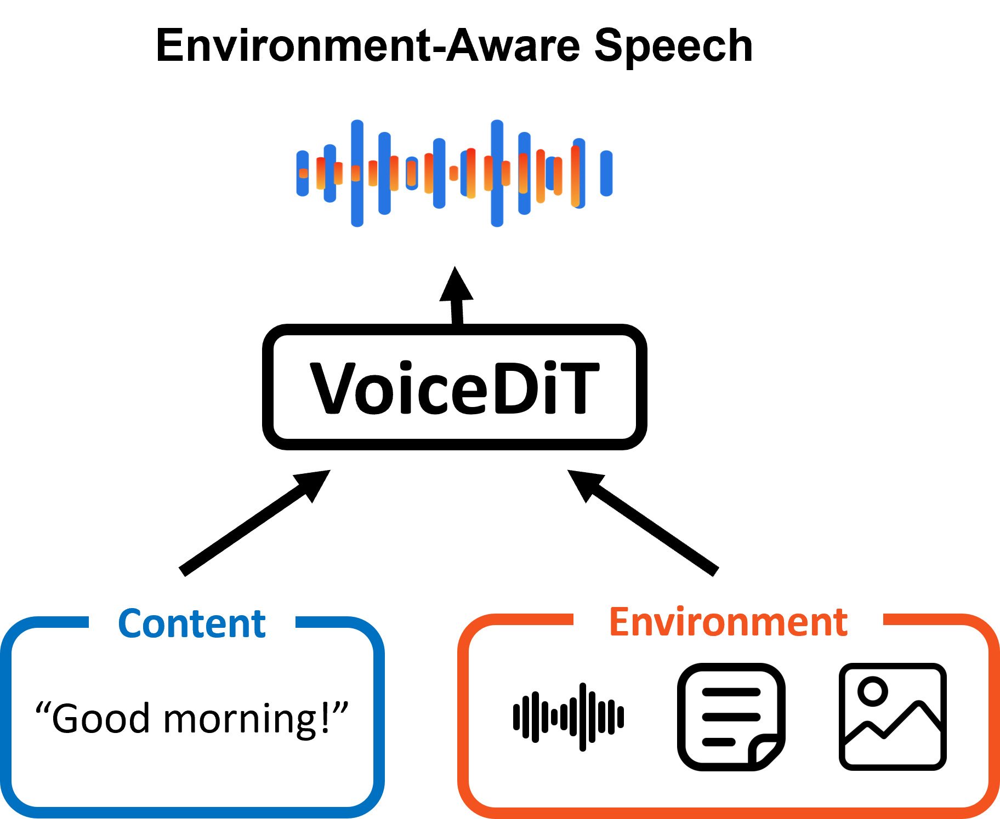

# VoiceLDM

This is a repository for the paper, [VoiceDiT: Dual-Condition Diffusion Transformer for Environment-Aware Speech Synthesis](https://arxiv.org/pdf/2412.19259), ICASSP 2025.

<p align="center">
  
</p>

VoiceLDM is an extension of text-to-audio models so that it is also capable of generating linguistically intelligible speech.

[2024/05 Update] I have now added the code for training VoiceLDM! Refer to [Training](#-training) for more details.

<a href='https://mm.kaist.ac.kr/projects/voicedit/'></a>  <a href='https://arxiv.org/pdf/2412.19259'></a>


## 🔧 Installation

### Install from source
```shell
git clone https://github.com/glory20h/VoiceLDM.git
cd VoiceLDM
pip install -e .
```

## 📖 Usage

- Generate audio with description prompt and content prompt:
```shell
python generate.py --desc_prompt "She is talking in a park." --cont_prompt "Good morning! How are you feeling today?"
```

- Generate audio with audio prompt and content prompt:
```shell
python generate.py --modality "audio" --desc_prompt "assets/bird_chirping.wav" --cont_prompt "Good morning! How are you feeling today?"
```

- Generate audio with image prompt and content prompt:
```shell
python generate.py --modality "image" --desc_prompt "assets/park.jpg" --cont_prompt "Good morning! How are you feeling today?"
```

- Text-to-Speech Example:
```shell
python generate.py --desc_prompt "clean speech" --cont_prompt "Good morning! How are you feeling today?" --desc_guidance_scale 1 --cont_guidance_scale 9
```

- Text-to-Audio Example:
```shell
python generate.py --desc_prompt "trumpet" --cont_prompt "_" --desc_guidance_scale 9 --cont_guidance_scale 1
```

- Image-to-Audio Example:
```shell
python generate.py --desc_prompt "assets/tiger.png" --cont_prompt "_" --v2a_guidance_scale 2 --desc_guidance_scale 9 --cont_guidance_scale 1
```

Generated audios will be saved at the default output folder `./outputs`.


## ⚙️ Full List of Options
View the full list of options with the following command:
```console
python generate.py -h
```


## 🙏 Acknowledgements
This work would not have been possible without the following repositories:

[VoiceLDM](https://github.com/glory20h/VoiceLDM)

[HuggingFace Diffusers](https://github.com/huggingface/diffusers)

[HuggingFace Transformers](https://github.com/huggingface/transformers)

[AudioLDM](https://github.com/haoheliu/AudioLDM)

[naturalspeech](https://github.com/heatz123/naturalspeech)

[audioldm_eval](https://github.com/haoheliu/audioldm_eval)

[AudioLDM2](https://github.com/haoheliu/AudioLDM2)